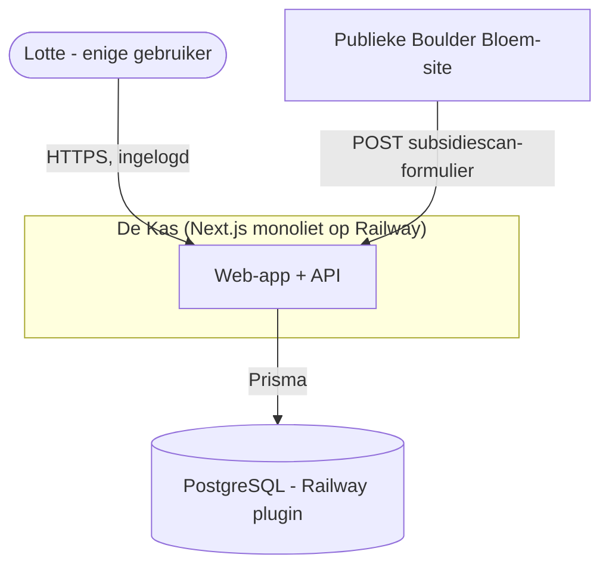

# 01 - Architectuur

## 1. Overzicht (C4 - niveau 1: System Context)


## 2. Containers (C4 - niveau 2)
```mermaid
flowchart LR
    subgraph Next["Next.js App (één deploy)"]
      RSC[Server Components / Pages]
      SA[Server Actions + Route Handlers /api/*]
      MW[Auth.js middleware/proxy]
      UI[Client Components: Ontwerpstudio (react-konva), Kanban, grafieken]
    end
    Auth[[Auth.js v5]]
    Prisma[[Prisma Client - singleton]]
    PG[(PostgreSQL)]

    UI --> SA
    RSC --> Prisma
    SA --> Prisma
    MW --> Auth
    Prisma --> PG
```

## 3. Stack-onderbouwing (kort, voor niet-developers)
- **Next.js App Router (monoliet):** één codebase levert HTML (Server Components),
  API-endpoints (Route Handlers) én formulieracties (Server Actions). Voor één bouwer
  scheelt dat een aparte backend. Zie ADR-0001.
- **Prisma + PostgreSQL:** je beschrijft je datamodel in één bestand (`schema.prisma`);
  Prisma genereert typeveilige database-code en versioneerde migraties. PostgreSQL kan
  JSON (JSONB) opslaan - handig voor canvas- en offertegegevens. Zie ADR-0002, ADR-0004.
- **Auth.js v5 Credentials:** simpele e-mail+wachtwoord-login voor één gebruiker.
  Env-variabelen met `AUTH_`-prefix; `AUTH_SECRET` is verplicht. Zie ADR-0005.
- **Konva/react-konva:** canvasbibliotheek met React-binding, roteren/schalen out-of-the-box,
  PNG-export en JSON-serialisatie. Zie ADR-0003.
- **Railway:** git-push naar `main` → automatische build & deploy; migraties draaien
  vóór live gaan. Zie ADR-0006 en `beheer-en-onderhoud.md`.

## 4. Repository-structuur
```
de-kas/
├─ app/                          # Next.js App Router
│  ├─ (auth)/login/page.tsx
│  ├─ (app)/                     # beschermde routes (achter middleware)
│  │  ├─ layout.tsx              # donkere zijbalk-layout
│  │  ├─ dashboard/page.tsx
│  │  ├─ klanten/…               # lijst, [id], nieuw
│  │  ├─ projecten/…             # lijst, [id] (stepper, wensen, taken, ontwerp…)
│  │  ├─ ontwerpstudio/[ontwerpId]/page.tsx
│  │  ├─ subsidies/…             # radar, aanvragen
│  │  ├─ educatie/…              # activiteiten, pakketten, lesbibliotheek
│  │  ├─ bibliotheek/…           # elementen, planten, partners
│  │  └─ instellingen/page.tsx
│  ├─ (print)/                   # printweergaven (les-PDF), ook beschermd
│  ├─ api/
│  │  ├─ auth/[...nextauth]/route.ts
│  │  ├─ health/route.ts         # 200 OK voor Railway healthcheck
│  │  └─ subsidiescan/route.ts   # publiek endpoint (Fase 6)
├─ components/                   # herbruikbare UI (ui/, canvas/, charts/)
├─ lib/
│  ├─ prisma.ts                  # singleton
│  ├─ auth.ts                    # NextAuth config
│  ├─ actions/                   # Server Actions (alle mutaties)
│  ├─ validators/                # Zod-schema's (canvas, offerte, subsidiescan, les, meting)
│  └─ domain/                    # domeinlogica (btw, valruimte, coach-checks)
├─ prisma/
│  ├─ schema.prisma
│  ├─ migrations/
│  ├─ seed.ts
│  └─ seed-data/                 # TS/JSON: subsidies, elementen, planten, educatie
├─ prisma.config.ts              # o.a. seed-command (tsx prisma/seed.ts)
├─ railway.json
├─ tailwind.config.ts
├─ .env.example
└─ docs/
```

## 5. Conventies
- **Data lezen** in Server Components via Prisma; **data muteren** via Server Actions
  (`"use server"`) met Zod-validatie aan de rand.
- **Nooit** `new PrismaClient()` in componenten; altijd `import { prisma } from "@/lib/prisma"`.
- Route-groep `(app)` staat achter auth-middleware; `(auth)` is publiek.
- Enums leven in Prisma; frontend importeert de gegenereerde types.
- Nederlandse veld- en modelnamen in de UI-laag; Prisma-modellen in het Engels/NL
  consistent zoals in `02-datamodel.md`.

## 6. Belangrijke niet-functionele eisen
- **Zero-downtime deploy:** healthcheck-endpoint verplicht.
- **Dataveiligheid:** dagelijkse PostgreSQL-backup (zie beheerdoc); `sslmode=require`.
- **Toegankelijkheid:** zie `03-ontwerpsysteem.md`.
