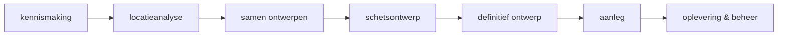

# Fase 1 - Klanten, projecten & taken

## Doel
CRUD voor klanten en projecten; 7-fasen-stepper; wensen; taken met deadlines;
dashboard v1 (kanban per fase, deadlines, volgende acties).

## Scope
**In:** Klant/Project CRUD, Wens- en Taak-beheer, fase-stepper, dashboard v1.
**Uit:** subsidies, ontwerp, educatie, offerte, meting.

## Fase-flow

## User stories (selectie)
- **US-1.1** *Als Lotte wil ik een klant aanmaken/bewerken, zodat ik contactgegevens
  centraal heb.* - Gemeente is verplicht (validatie faalt zonder gemeente).
- **US-1.2** *Als Lotte wil ik een project aan een klant koppelen met naam, fase, status,
  oppervlakte, budget en volgende actie, zodat het project traceerbaar is.*
- **US-1.3** *Als Lotte wil ik de fase van een project via een stepper verzetten, zodat
  de voortgang zichtbaar is.* - Klik op fase zet `Project.fase`; historie niet vereist.
- **US-1.4** *Als Lotte wil ik wensen vastleggen met bron en prioriteit (moet/graag/misschien)
  en ze afvinken als verwerkt.*
- **US-1.5** *Als Lotte wil ik taken met deadline en categorie beheren (project-gebonden of los).*
- **US-1.6** *Als Lotte wil ik op het dashboard projecten-per-fase als kanban zien, plus een
  deadlines-lijst en volgende acties, zodat ik overzicht heb.*

## Acceptatiecriteria dashboard (US-1.6)
- Kanban toont kolommen per `ProjectFase`; kaarten tonen naam, klant, volgende actie.
- Deadlines-lijst toont openstaande taken gesorteerd op datum; verlopen = clay-deep.
- "Volgende acties" toont projecten met `volgendeActieDatum` ≤ 14 dagen.

## Routes
- `/klanten`, `/klanten/nieuw`, `/klanten/[id]`
- `/projecten`, `/projecten/nieuw`, `/projecten/[id]` (tabs: overzicht, wensen, taken)
- `/dashboard` (kanban + lijsten)

## API/Server Actions
- `createKlant`, `updateKlant`, `deleteKlant`; idem project; `addWens`, `toggleWensVerwerkt`;
  `createTaak`, `toggleTaak`. Alle met Zod-validatie.

## Databasewijzigingen
- Modellen `Klant`, `Project`, `Wens`, `Taak` (zie datamodel). Migratie `0001_kern`.

## Definition of Done
- [ ] Klant + project CRUD werkt end-to-end.
- [ ] Stepper verzet fase en persistent.
- [ ] Wensen en taken toevoegbaar/afvinkbaar.
- [ ] Dashboard toont kanban, deadlines en volgende acties met echte data.

## Testplan
- Unit: Zod-validators (gemeente verplicht).
- Handmatig: aanmaken klant→project→wens→taak; dashboard verifiëren.

## Risico's
- Cascade-verwijderen: check dat project verwijderen wensen/taken netjes opruimt.
