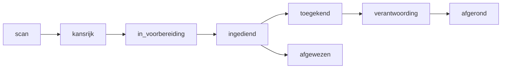

# Fase 2 - Subsidieradar

## Doel
Databank van Nederlandse subsidieregelingen (geseed), aanvragen-pijplijn per project,
deadlines op dashboard, "laatst gecheckt"-kleurcode.

## User stories
- **US-2.1** *Als Lotte wil ik alle regelingen kunnen doorzoeken/filteren op niveau, regio
  en status, zodat ik snel een match voor een gemeente vind.*
- **US-2.2** *Als Lotte wil ik per regeling zien wanneer die "laatst gecheckt" is met kleurcode
  (groen <3 mnd, oranje ouder), zodat ik verouderde info herken.*
- **US-2.3** *Als Lotte wil ik een aanvraag koppelen aan project + subsidie en door de statussen
  bewegen (scan→kansrijk→in voorbereiding→ingediend→toegekend/afgewezen→verantwoording→afgerond).*
- **US-2.4** *Als Lotte wil ik subsidie-deadlines op het dashboard zien.*

## Pijplijn (Mermaid)

## Routes
- `/subsidies` (radar met filters + kleurcode), `/subsidies/[id]`,
  `/projecten/[id]` → tab "Subsidies" (aanvragen-pijplijn per project).

## Databasewijzigingen
- Modellen `Subsidie`, `SubsidieAanvraag`. Migratie `0002_subsidies`.

## Seed-data
- Zie `docs/seed-data/subsidieregelingen.md` (geverifieerde regelingen + `laatstGecheckt`).

## Definition of Done
- [ ] Radar toont geseede regelingen met filters.
- [ ] Kleurcode werkt op `laatstGecheckt`.
- [ ] Aanvraag-pijplijn per project werkt; statuswissels persistent.
- [ ] Subsidie-deadlines verschijnen op dashboard.

## Risico's / caveat
- Bedragen en deadlines verouderen; UI moet dit tonen, niet verbergen.
